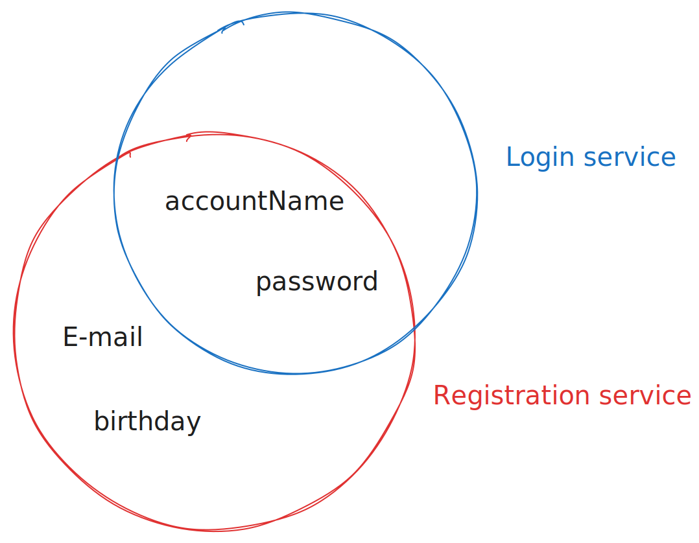

# Masterclass
In this document, you will learn the following:
1. The [core values](#core-values) of the semantic.works stack and their benefits
2. How our [design decisions](#design-decisions) reflect those values
3. What [implementations](#implementations) this resulted in

## Core values
### 1. Productivity through simplicity
- 1a) **Efficient development:** We wanted to get stuff done, without the requirement of being an expert on every topic, or creating a system that only the computer would understand
- 1b) **Clear overview:** Efficient development also comes in the form of overbloated applications, where you can easily lose track of what is handled where. We want to be able to look at a service and know immediately what it does.
- 1c) **Less required reading**: There exists a saying in computer science that developers will end up with spending 90% of their time reading through code and 10% writing code. This reduces our effectiveness. For every line we write we will end up reading 10 lines first.
- 1d) **Allow reusing**

### 2. Functionality through interoperability
- 2a) **Maximize freedom:** There need to be rules: as few and liberating as possible. A lack of rules would cost interoperability, which would subsequently limit your freedom in the end.
- 2b) **Expandability:** We also wanted orthogonal features: features that would extened eachother at no extra cost.
- 2c) **Longevity:** Something built years ago should still work as expected.

 

## Design decisions
### Micro
- By isolating functionality by the boundaries of a microservice you get small but focused services: making them reusable easy to understand ([1a: efficient development](#1-productivity-through-simplicity)) 
- They are oftenly very easy to read, allowing a basic understanding even for those who do not know the language or framework in question ([1c: less required reading](#1-productivity-through-simplicity))
- Due to the small size of the services, debugging is easier: there are only a few hundred lines of code per service. Even if those 100 lines are important and take you longer to read, it reduces the area you need to look in ([1a: efficient development & 1b: clear overview](#1-productivity-through-simplicity)).

### Standard API's
- Thanks to using technologies like JSON:API, services built years prior can still work as expected. ([2c: longevity](#2-functionality-through-interoperability))
- Using these standards means more assumptions can be made and less code needs to be read ([1c: less required reading](#1-productivity-through-simplicity))

### Centralised communication
The microservices never talk to eachother directly. Instead they use a **shared linked-data** database. This is complemented by microservices using a semantic model. ([2a: maximize freedom & 2b: expandability](#2-functionality-through-interoperability))

### Semantic models

Semantic models have a bunch of advantages:
- They can easily be appended upon ([2b: expandability](#2-functionality-through-interoperability))
- They allow re-using the same models: the same model can be used for username/password, OAuth, or even mock logins ([1a: efficient development, 1d: allow reusing](#1-productivity-through-simplicity), [2a: maximize freedom, 2b: expandability](#2-functionality-through-interoperability))

## Implementations

### Simple Mental Model
#### Basic

#### In-depth

([micro](#micro))

1. The **identifier** will create a session cookie. This doesn't identify you as a person (as this depends on what is in the database), but it gives a general hook ([centralised communication](#centralised-communication))
2. The **dispatcher** will decide which **microservice** will be called for the made request
3. Then the **triplestore** will change the requested state, yield a response of what has changed in the database, read the information you requested...

For example: this setup also means that the other services don't care what registration method was used, as they all work from the same [semantic models](#semantic-models) and database, yet care about different aspects of it.

### Limited base technologies
- **HTTP for communication:** If you build web application, you're probably already familiar with HTTP. ([Standard api's](#standard-apis))
- **JSON(:API) for sending data:** any programming language or framework that can read the widely known and used JSON will be able to be used. We then selected JSON:API to ensure consistency in our structure ([Standard api's](#standard-apis))
- **SPARQL for storing data:** SPARQL queries are also just strings: any technology that can manage JSON will be able to use SPARQL in one way or another. This way we can store all our data as linked data, whilst enjoying the compatibility of JSON.

### Docker & Docker-Compose
Docker allows for most technologies to be used on most systems. Docker-Compose are YAML files describing the topology of Docker containers and how they interact whith eachother, which gives us a place to define a central structure of our project. ([Micro](#micro), [Standard API's](#standard-apis))

#### Naming conventions:
To ensure quick onboarding, a lot of our docker-compose files following a naming scheme:
|           Filename            | Description |
| ----------------------------- | ----------- |
| `docker-compose.yml`          | General **production** setup, basis for all other docker-compose-*.yml |
| `docker-compose.dev.yml`      | Overrides for **development** | 
| `docker-compose.override.yml` | Overrides for specific systems/deployments. Do *not* commit |
| `docker-compose.demo.yml`     | (Extra) Demo to help people get started |

 

### Categories
We structure our projects into different categories for easier re-use and discoverability. Please check out [project-categories.md](project-categories.md)

*This document has been adapted by Denperidge from...*
- *Aad Versteden's masterclass video series. You can view the original video [here]()*
- *Jonathan Langens' mu.semte.ch article. You can view it [here](https://mu.semte.ch/2017/08/31/how-mu-semte-ch-can-help-you-beat-the-10-odds/)*
